# 清动家园交付文档

*清华大学软件学院软件工程 2020年秋 C03 组*

*开发过程文档连接：https://github.com/Ocean-627/StadiumsTHU/tree/master/doc*

## 交付产品

**服务器域名：**https://cbx.iterator-traits.com/

**小程序码：**

**管理员账号：**2020010001   **密码：**12345678

## 产品目标

### 📌 功能要求

#### 普通用户

普通用户应能便捷地完成场馆预约操作流程，包括**查看场馆**、**预约场馆**、**选择时段**、**在线缴费**、**签到及签离**等基本流程。为了增进用户体验，添加**场馆评论**功能及**场地预订开始及结束提醒**功能、**场馆信息筛选**功能、**收藏场馆**功能以及**查看并取消当前预约**功能。为突出与现有竞品的优势，添加**地图导航**功能。此外，应支持基本的**上传并修改用户信息**等操作。

#### 管理员

管理员应能进行场馆预约及用户相关管理，包括**添加新场馆**、**修改场馆信息**、**场地预留**等预约管理操作及**查看用户列表**、**撤销违约记录**、**移入或移出黑名单**等用户管理操作。此外，支持管理员查看**历史操作记录**并对特定操作进行**撤销**。为增进用户体验，管理员能够查看**预约相关统计信息**以为决策者提供更好的决策参考。

### 📈 性能要求

系统应能长期稳定运行以进行相关定时事件的处理，同时应支持一定程度的高并发，以满足每日开始放出预约时段时用户大规模登录预约系统的场景。

## 开发组织管理

### 👣 过程管理

#### 每周会议

团队定于每周二晚9:00于南区十号楼地下讨论区举行每周会议，要求全体成员必须参加。部分成员临时有事可提前说明并重新确定当周会议日期，每次会议持续约两个小时，主要用于总结上周进展及布置下周任务，团队成员集体讨论相关问题的解决方案并尽可能地达成一致意见。

#### 集中开发

团队定于每周四下午或晚上于清华学堂地下研讨间进行集中开发，集中开发时间固定为4个小时。集中开发期间，主要解决上次会议后在实现过程中发现问题需要更改相关标准的模块。

#### issue及项目看板的使用

每次迭代会议过后通过issue布置相关任务，团队成员使用项目看板汇报进度完成情况。如在开发过程中遇到新的问题，仍可通过新建issue向其他成员反映。

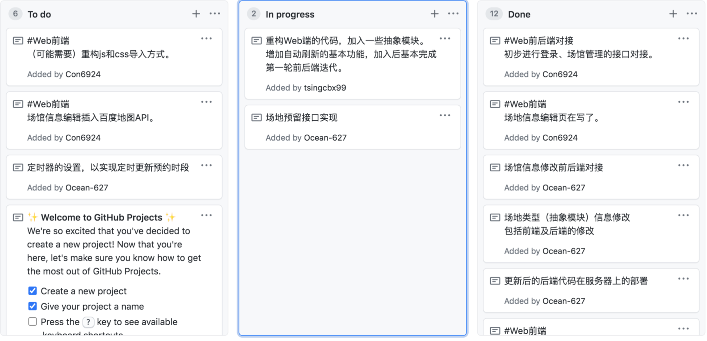

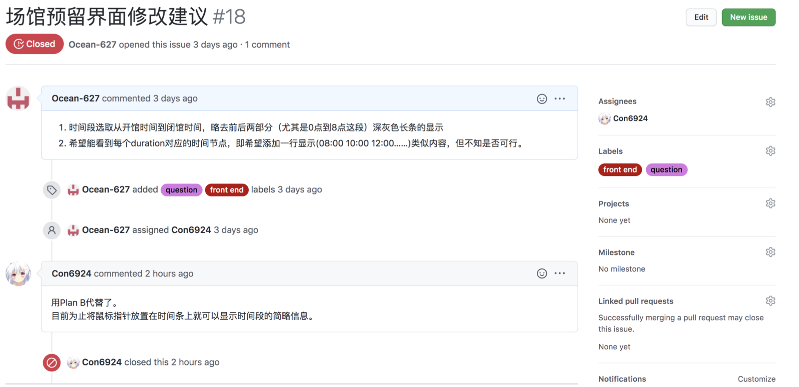

### 👬 人员分工

| 姓名   | 分工                                                         |
| ------ | ------------------------------------------------------------ |
| 胡浩宇 | 小程序端界面开发<br />小程序端部署                           |
| 陈柏旭 | 数据库表与后端接口设计<br />后端用户相关接口及管理员相关部分接口<br />测试相关 |
| 杨宇泓 | Web前端界面开发<br />Web端部署                               |
| 徐鑫浩 | 数据库表与后端接口设计<br />后端管理员相关部分接口<br />Web前端部分界面的设计、调整与接口的对接 |

### 🔨 开发环境

| 类别       | 集成开发环境       | 框架          |
| ---------- | ------------------ | ------------- |
| 小程序前端 | 微信开发者工具     | VantUI + WeUI |
| Web前端    | Visual Studio Code | Vue + jQuery  |
| 后端       | Pycharm            | Django        |

### 🔑 配置管理

项目大体上沿以下4个分支进行开发。

- **master**分支存储经完备测试后的代码。
- **web-frontend**分支用于编写Web前端静态界面。
- **webapp**分支用于编写Web前端与后端的交互代码，并定期将测试后的代码merge到**web-frontend**上。
- **backend**分支主要用于后端开发。

由于小程序端开发相对独立，且小程序端开发人员所做工作与其他成员的工作耦合程度很低，故小程序前端只需定期将所做工作push到**master**分支即可。


## 系统设计

### 📱 前端交互 - 用户系统（小程序端）

#### 架构选择

用户预约场地相对于管理员管理场馆信息来说是一个比较简单且信息量不那么丰富的操作，此外考虑到用户日常访问网络更多依靠手机，平板这样的移动设备而不是电脑，所以采用移动端的应用来进行预约系统的开发更加合理。而在移动端应用程序的选择上，小程序相比于APP更贴近于传统的web前端设计方式，降低了学习成本，且小程序底层具备安卓和IOS的兼容性，因此，我们选择小程序进行预定场地系统的开发。

在UI界面的设计上，为了实现美观和部分界面较复杂的筛选逻辑，采用了VantUI+WeUI以及自己实现的样式结合的方式。

#### 业务流程

通过登录清动家园小程序端，普通用户能够方便快捷地进行场馆预订，具体的操作流程如下图所示。

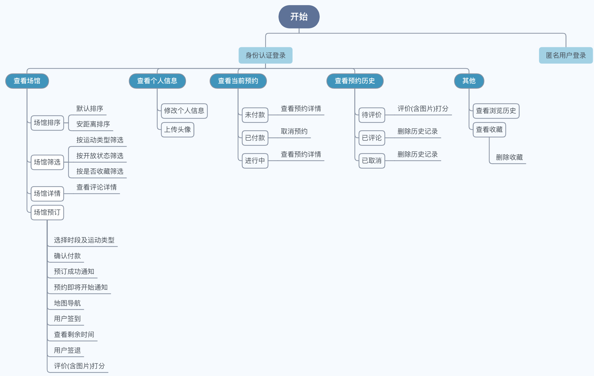

#### 业务实现

- 认证登录：用户通过清华校园身份认证登录

- 场馆浏览：浏览所有的场馆（包括它们的名称，位置，开放时间，运动项目等信息）
  - 场馆筛选：通过运动项目，收藏，开放信息进行筛选，通过距离，人气，评分进行排序，关键词搜索
  - 场馆查看：查看场馆具体信息，包括简介，须知，他人评论
  - 位置查询与地图导航：通过地图上的标记和路线图告知用户相关信息
  - 收藏场馆：将场馆加入收藏

​              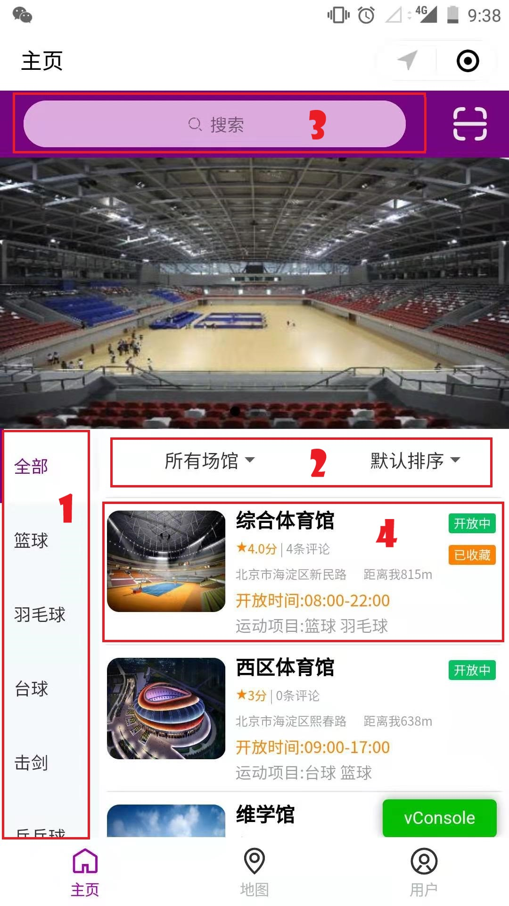                         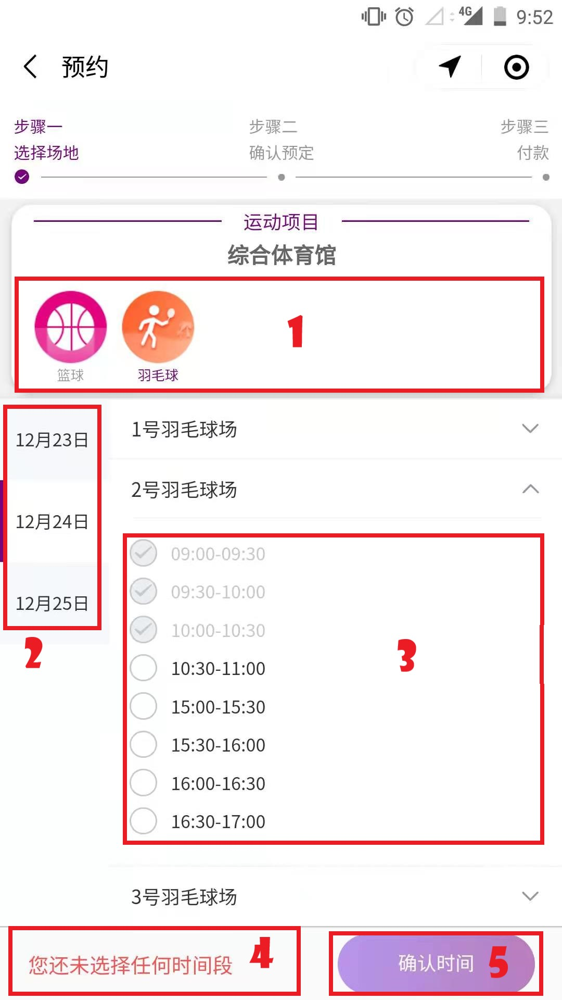

- 场地预约：查看可以预约的场地并选择可以预约的时段
  - 场地筛选：通过运动项目，日期，场地编号进行筛选
  - 预约确认：显示预约的各项信息以供用户确认
  - 预约付款：通过多种付款方式进行付款
  
- 预约记录：查看各种状态中的预约记录（未付款，已付款，进行中，待评论，已评论，已取消）
  - 取消预约：用户可以在预约尚未开始的一段时间内取消预约
  - 前往付款：用户可以为尚未付款的预约进行付款
  - 评论/查看/撤销评论：用户可以评论场地/查看过去的评论内容/撤销过去的评论
  - 删除预约记录：用户可以删除已评论和已取消的预约记录

​             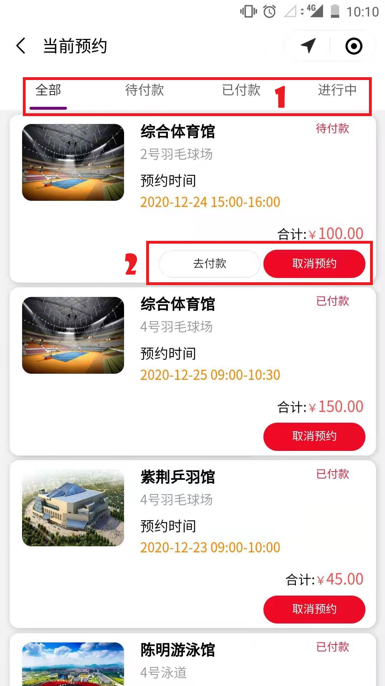                        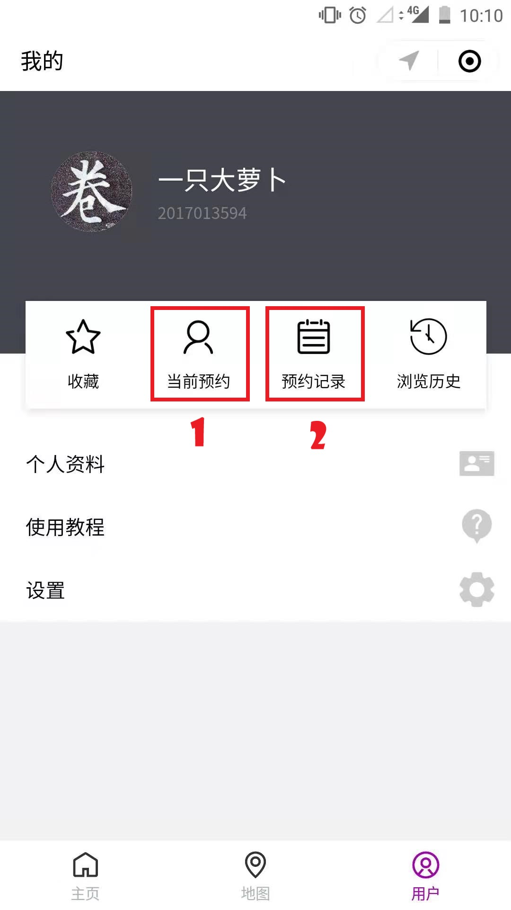

- 个人信息：用户可以管理自己的个人信息（头像，联系电话，邮箱，昵称）

- 浏览历史：用户可以查看自己的浏览历史记录

- 使用教程

- 消息通知：用户会在预约成功/预约被取消/预约即将开始和结束时收到服务通知


### 🖥 前端交互 - 管理系统（Web应用端）

#### 架构选择

考虑到管理员工作的主要需求在于能浏览不同类型的数据，在此之上对场馆、用户等数据记录进行管理，我们认为管理系统的交互重点与用户系统的**简单易用**不同，更应该偏向于**功能化**，同时应该合并对同样资源的重复处理。因此我们选择使用Web端进行管理系统的架构。

同时，为了适配可能出现的特别需求，我们采用了基于Bootstrap实现的响应式前端框架，在平板电脑（以iPad为例），甚至屏幕更小的手机上，我们的管理系统也有接近完整的使用体验，而不会出现样式大规模丢失或是操作流程错误的现象。

​      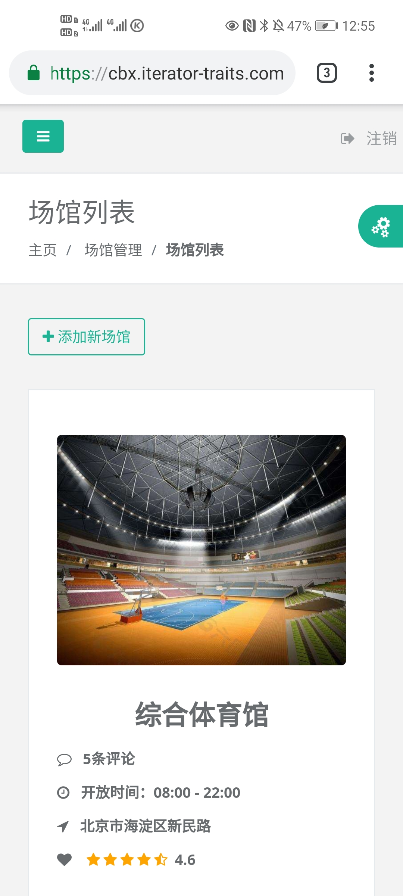                   

#### 业务流程

通过登录清动家园网页端，管理员能够进行对预约平台的管理，包括修改场馆基本信息、预约相关信息、场馆预留、查看预约等场馆预约相关管理操作，查看用户列表、查看用户信用详情、设置用户黑名单状态等用户相关管理操作，以及查看操作记录、查看统计信息及系统版本信息等其他操作，具体的操作流程如下图所示。

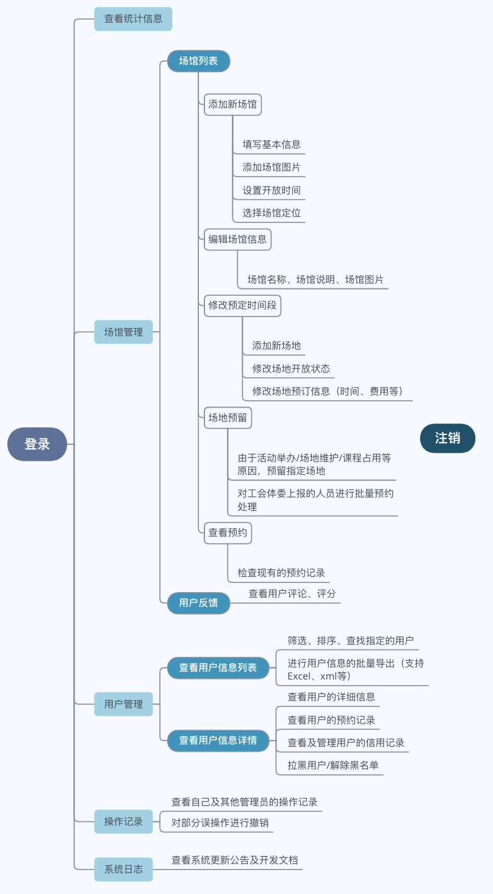

#### 业务实现

作为运动场馆预约系统的管理员，首要的业务需求应该在于对**场馆**、**用户**以及**预订记录**的管理。我们根据页面的结构，对上述业务实现进行介绍。

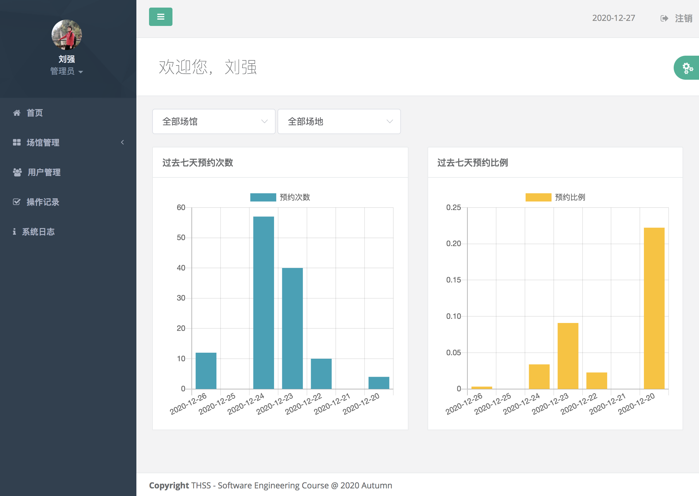

- 首页：提供过去七天内各场馆、各类运动场预定情况的数据统计结果。

  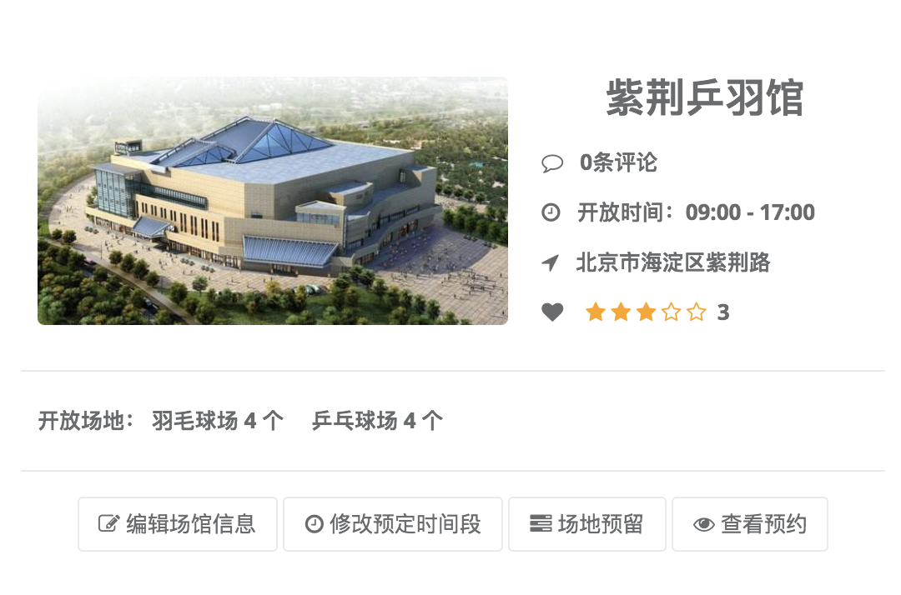

- 场馆管理
  - 场馆列表
    - 添加新场馆：创建一个可供预约的新场馆。
    - 编辑场馆信息：对场馆基本信息（场馆说明、联系方式、场馆图片等）的修改。
    - 修改预定时间段：对场馆可预订时间、可预订场地的修改。
    - 场地预留：管理员可以根据活动举办/场地维护/课程占用等需要，对指定场地进行预留；也可以用于对工会体委上报的预订需求进行批量预订。
    - 查看预约：查看当前场馆已有的预约。

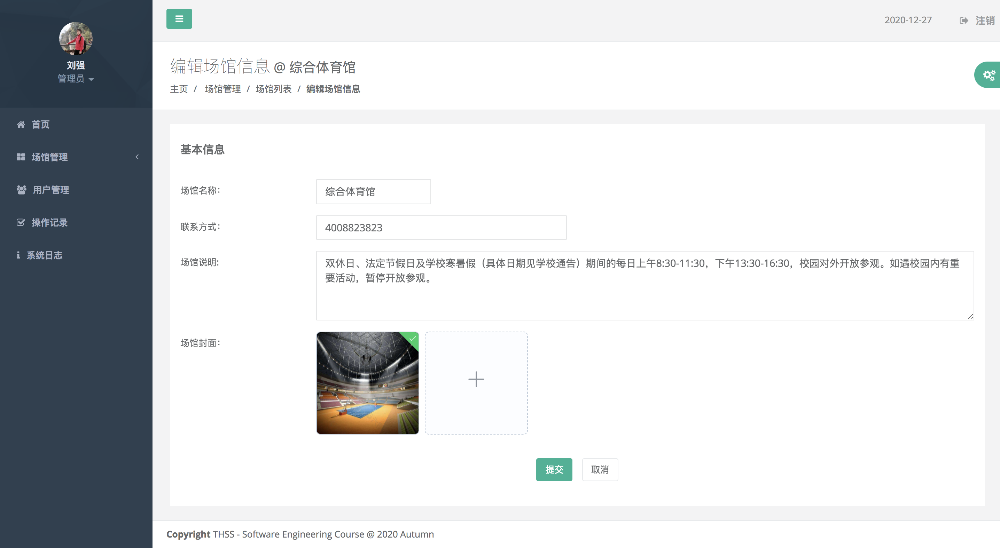


  - 用户反馈：用于查看用户的评论、评分。
- 用户管理：管理员在此查看用户信息，进行用户信息的批量导出，或对用户的预订记录、信用和黑名单状况进行查看和管理。

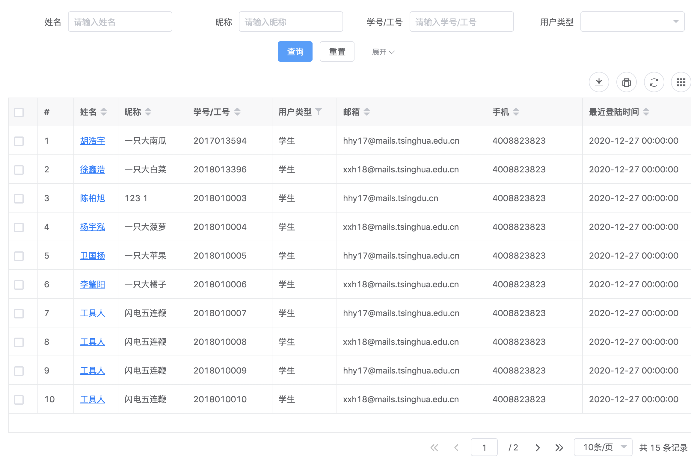

- 操作记录：管理员在此查看自己以及其他管理员的操作记录，并可以对部分误操作进行撤销。
- 系统日志：用于存放系统的发布和更新日志。

### ⚙ 后端模块

#### 业务逻辑实现

依照`restfulAP​`规范中的面向资源编程，`url`的名称均为一种资源，可以是实体资源也可以是事件。并为增删改查对应实现`post,get,put,delete​`方法。

具体实现中结合了很多`restful_framework​`定义的工具类：

视图层次上主要基于`APIView,ListAPIView,CreateAPIView`

身份认证：基于`BaseAuthentication​`

序列化：基于`ModelSerializer,Serializer​`

筛选、查找：基于`FilterSet​`

访问频率控制：基于`SimpleRateThrottle​`

另外还定义了`validator,pagination,exception​`等模块。

基于以上这些工具类，很多接口可以非常简洁的实现，以用户的`CourtView`为例，其视图函数定义如下：

```python
class CourtView(ListAPIView):
    """
    场地信息
    """
    authentication_classes = [UserAuthtication]
    throttle_classes = [UserThrottle]
    queryset = Court.objects.all()
    serializer_class = CourtSerializer
    filter_class = CourtFilter
```

该视图函数自动的完成以下功能，在用户发送请求时首先验证身份，并判断是否超过访问频率。而后在`queryset`中根据一些筛选规则查询，最后由序列化器返回。

`django`框架也为这样的视图提供了很大的扩展性，通过重写一些钩子函数如`get_queryset`即可实现自定义的处理逻辑。

#### 实现优势

从功能上：实现了复杂的操作逻辑，通过了测试。实现的功能非常齐全。

架构上有以下优势：视图函数解耦了操作的几个层次，很好的对实现进行了模块化。

扩展性比较好，对于`get`请求非常容易返回更多字段给前端，尚未实现的一些模块和当前框架耦合不大，比如实现抽签功能时只需要为管理员端写一个抽签算法，稍微修改预订状态即可完成。

进行了完备的参数检查，包括类型、格式、合法性检查，自定义错误返回结果并修改返回状态码，前端可以通过`status_code`进行拦截，区分。

绝大多数函数的效率很高，没有使用繁杂的多重循环。

#### 实现不足

`restfulAPI`的固有缺陷，返回太多无用数据，降低了效率，同时增加了前端的工作负荷。

`duration`类的定义不够合理，这个类的用意为将一天的时间根据最短预订时间划分为若干个单元格，用户在预订时实际上是选择其中的一些单元格，这样简化了前端的操作。但实际结果发现其导致了很大的弊端，很多资源关于`duration`产生了耦合。并且该问题发现比较晚，难以进行修改。

`serializer`类承担的任务过重，除了验证字段和序列化资源的基本用法，还额外承担了创建事件的任务。这些代码应该移入视图函数中，而不是定义在序列化类中。

存在一定的效率缺陷，极少数查询结果涉及关于外键内容的二次查询。

### 🔌 接口规范


### 📊 数据库设计

数据表共设定20个类，主要划分为实体对象类和事件类。

#### 实体对象类

```python
class User			用户
class Manager		管理员
class Stadium		场馆
class CourtType		运动时段安排
class Court			场地
class Duration		时段
class Comment		评论
class StadiumImage	场馆图片
class CommentImage	评论图片
```

它们之间存在一些一对多关系，如场地与场馆，在数据表中由外键实现。定义图片类的原因`django​`是关系型数据库，无法存储列表。

#### 事件类

```python
class ReserveEvent	预订事件
class CollectEvent	收藏事件
class Default		违约记录
class ChangeDuration修改预约时段事件
class AddEvent		添加场馆占用
class AddBlacklist	添加黑名单
class OtherOperation其他操作
class Session		会话
class Message		聊天消息
class New			系统信息
class Statistics	统计信息
```

## 重难点问题及其解决方法

### ⚙ 后端

由于用户和管理员使用同样的数据表，存在本质的耦合关系，所以后端实现的难点之一就是如何解耦各种资源，另外解耦的过程中也受到框架的限制。

另一方面，事件信息自然是与资源耦合的，比如添加新场地，根据针对资源编程的原则其`url`是`/api/user/stadium/`，方法为`post`，但是其会产生一个添加新场地的事件，这个事件的创建不得不由该视图函数来完成。

最后，前端的展示需求往往是耦合的，为了保证用户良好的操作体验，在编辑场馆的时候可能需要提示场地的信息。另外前端的一些组件存在渲染上的问题，限制了获取某些信息必须使用一个接口。

以上是比较宏观的描述，具体来说管理员端的很多操作本身就涉及非常复杂的逻辑，如添加场地占用，我们实现了系统智能搜索，这需要遍历时段找到符合要求的连续时段，我们实现了强制占用，即占用某些用户已经预约的场地，这就产生了一连串问题——需要给用户发送提示，需要更改场地的状态，需要改变用户预约记录的状态。另外我们还支持对部分操作的撤销。

### 📱 小程序端

小程序端的关键问题在于设计用户友好的界面，主要体现在一下几个方面。

- 危险性操作提示

- 列表数据上拉分页，下拉刷新

- 预约界面一次载入多个场地数据，避免每次切换场地都要重新请求数据。

- 几乎所有的网络请求都带有加载提示和成功/失败提示

- 搜索功能会实时显示搜索结果，支持拼音检索。

- 简明的使用教程

- VantUi 与 WeUI配合一些自己实现的样式搭建出符合用户审美习惯的界面

- 在大小不同尺寸的手机上都有良好的视觉效果

### 🖥 Web端

- 设计方面：配色、动画设计和控件选取（放弃了更难搭配的紫色，使用绿黑白为主色调）
- 架构方面：Promise是个好东西 - 异步操作、操作链的正确连接
- 实现方面：多方组件的适配性（各组件存在奇妙的冲突）、组件的兼容性（jQuery组件迁移到Vue）、组件甚至有bug

## 测试总结

### 🎛 功能测试方法

#### 后端单元测试

工具为`Postman`和`django`内置的`TestCase`。测试文件在在`app/test`目录下。

主要的切入点是各个视图函数，对于每个`url`对应的增删改查操作进行测试，保证其基本逻辑正确。例如在测试预订时，首先测试预订非法输入能否返回错误，合法预订能否成功，再次预订同一时段能否成功，撤销后状态是否发生变化等等一系列逻辑。该测试覆盖了所有`url`。

进行了上述所说的对单个`url`测试后，我们还组合了一些`url`进行测试，尤其是管理员部分复杂的逻辑，根据`28`原则，我们认为这些部分有更高的概率出现`bug`。进行组合测试的原则是覆盖用户使用的基本流程，比如在添加场馆时要首先添加场馆，然后编辑这个场馆的场地，而后可能进行修改等等。

单元测试的时间和简要目的在各个测试文件中，这里就不一一列举了。

#### 后端回归测试

做的工作是添加新的功能后重新测试之前已经实现好的功能，结果非常好，及时的找出了`bug`，并且其还有一个隐含的作用，如果发现之前的测试几乎不需要改动，那么证明程序解耦做的比较好。

#### Web端与小程序端功能测试

相当于测试最终的项目表现，主要进行人工测试，方法为一个前端人员和一个后端人员一起测试，首先测试所有页面的所有功能。而后原则是模拟用户操作的各个流程，确保流程没有问题，例如在小程序端进行了用户预订的全部流程，在网页端测试了管理员添加场馆的过程等。

### ⚠️ 缺陷汇总

经测试，小程序端在界面切换速度较快时偶尔会出现加载条无限加载的情况，出现频率较低，不影响正常功能的使用。

### ⏰ 性能测试方法

后端部分基于`Jmeter`，主要测试了速度和稳定性。小程序端则通过微信小程序开发调试 -> 性能监控面板可以对小程序运行时的各项性能数据进行监测，并利用微信开发者工具自带的Audits进行性能，体验等方面的综合测试。

### 〽️ 性能测试结果

#### 后端

测试中发现一个巨大问题是mysql的并发数，更改为2000后明显好转。速度方面，主要对各种`get`接口进行测试，访问`localhost`时大多数端口的时延在2.5s-3.5s，猜测是访问远程数据库降低了效率，部署后再次测试降低到1s-2s，达到可接受范围。稳定性方面，分别进行了500路并发和1500路并发实验，500路并发时稳定没有错误，1500路并发20轮测试时，前1-2轮有10%-20%的错误，但从第三轮开始稳定没有错误，不会出现两个用户同时预订一个场馆时同时获得的情况。实际使用时小程序体感延迟很低，应该在1s以下，网页端有约1s-2s的延迟。此外，测试中注意到服务器端运行后端与本机运行后端相比会有较高延迟。

#### 小程序端

##### 性能监控面板测试结果

| 性能数据     | 波动范围                              |
| ------------ | ------------------------------------- |
| CPU          | 10%-25%                               |
| 内存         | 700-800m                              |
| 页面切换耗时 | 200-500ms                             |
| 启动耗时     | 1.5-2.5s                              |
| 帧率         | 基本稳定在60fps                       |
| 数据缓存     | 175B - 25KB（与历史记录最大条数有关） |

##### Audits测试结果

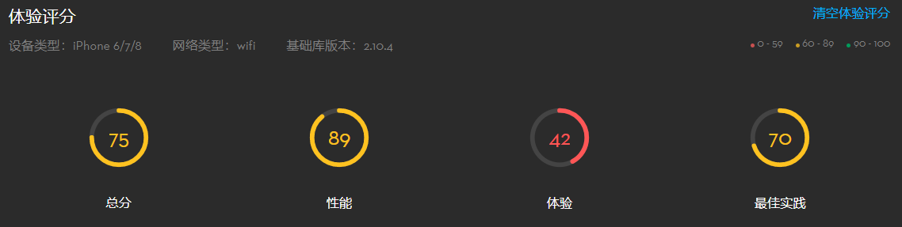

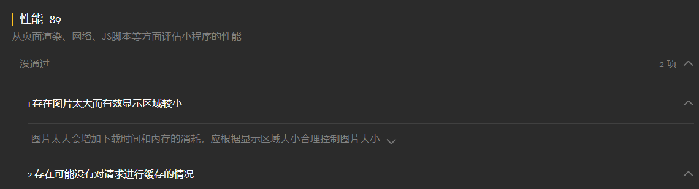

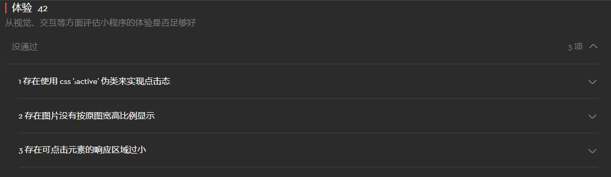

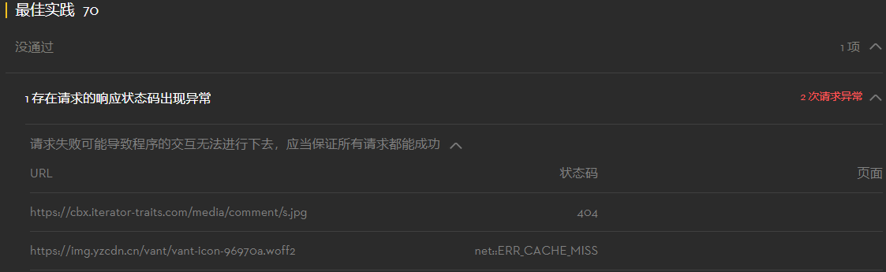

**性能方面**：可能会考虑进一步统一图片尺寸和显示区域，顺便可以解决图片没有按原尺寸显示的问题

**体验方面**：测试中显示的其余两个问题（点击态/相应区域过小）的问题主要来自VantUI组件，点击态问题的解决可能涉及到修改VantUI组件代码，暂不考虑。点击区域过小问题与微信测评系统的判定有关，所有列举出的问题组件虽然可点击，但均没有设置有效的点击事件（装饰使用），或者其点击事件与周围更大的组件是一样的，所以该项问题实际上不影响使用。

**最佳实践**：由于后端在返回错误信息的同时修改了状态码，这与微信要求的不符，但是这不会影响交互。

### 📲 小程序端兼容性测试

### 兼容性测试

#### 小程序端


由于小程序依赖于微信底层的特殊性，不同的微信小程序版本对于我们小程序部分功能和页面样式的兼容性有所不同。同时微信小程序需要在各种尺寸的手机以及平板电脑上运行，页面样式是否会变形，是否会影响使用也是测试关注的重点。

#### 测试方法

通过微信开发者工具，调整调试版本库，观察每个页面是否能正常渲染，功能是否能正常运作。通过模拟器调节不同的机型，观察每个页面的渲染情况。

#### 测试结果

##### 版本兼容性：

| 版本            | 功能情况             | 页面情况                    |
| --------------- | -------------------- | --------------------------- |
| 2.10.4 - latest | 完整                 | 完整                        |
| 2.9.5 - 2.10.4  | 推送通知无法使用     | 完整                        |
| 2.7.7 - 2.9.5   | 地图导航无法使用     | 完整                        |
| 2.0.9-2.7.7     | 同上                 | 预约界面scroll-view排版错误 |
| 2.0.9以下       | 预约记录无法切换分页 | VantUi大面积失效            |

##### 机型兼容性：

| 机型               | 页面情况                                                     |
| ------------------ | ------------------------------------------------------------ |
| ipad Pro 10.5 12.9 | 预约记录和场馆信息页面按钮与文字比例不协调，主页场馆信息行间距有差异 |
| 其它               | 视觉效果符合预期                                             |

## 系统部署

### 📍 部署环境

Ubuntu Server 20.04 LTS 64位 服务器

### ⚱ 容器部署

项目使用基于 Docker (version 19.03.13) 的容器部署方式。使用到的镜像为：

- python: 3.7 - 用于部署后端应用，容器暴露 8000 端口。
- mysql: 5.7 - 用于部署数据库，容器暴露 3306 端口，与后端共享一个网络，仅供后端访问。
- nginx: latest - 用于部署代理，映射主机的 80 和 443 端口，与后端共享一个网络。

为了信息安全，数据库的隐私设置使用``.env``文件进行配置。

### 🔙 NGINX反向代理部署

#### 多进程和并发链接设置

项目的 nginx 代理配置了 2 个工作进程数（worker_processes），每个进程使用 **epoll** 进行性能优化，支持的最大并发链接数为1024/进程。

#### http/https 协议设置

代理限制了请求的Header大小不超过2k（否则会返回494错误）。

请求的主体部分（body）不得超过20M。

代理开放了用于http服务的80端口，以及用于https服务的443端口。http请求将会被重定向到https的端口，同时返回**http301**。单个https的会话过期时间为一天。https使用ssl协议进行加密。

#### 代理路径设置

代理对四种路径进行分发：

- ``/`` ：非以下类型的路径将被分发到前端Vue处，作为前端网站访问。
- ``/api`` ：后端接口使用的路径，转发到后端处理。
- ``/media`` ：图片、视频等文件的访问接口。
- ``/static`` ：静态文件服务。

### 📲 小程序端部署

#### 小程序发布

通过直接在微信公众平台上发布小程序，其他人可以直接在微信 - 搜索小程序中通过名称“**清动家园**”直接搜索到我们的小程序。

(PS：由于发布版小程序直接跳转到了发布版清华校友会小程序，无法正常验证身份，所以还是请使用体验版)

可以扫描下方二维码，申请使用体验版。


#### 本地运行

小程序的代码与小程序号（appid）是绑定的，所以如果想运行他人的小程序稍有些复杂。

1. 在[微信公众平台](https://mp.weixin.qq.com)申请成为小程序开发者并获得一个小程序号。
2. 修改**微信小程序**文件夹下的**project.config.json**文件，将里面的**appid**字段修改为获得的小程序号。
3. 打开微信开发者工具 -> 导入项目 -> 选择微信小程序文件夹 -> appid输入获得的小程序号 -> 导入
4. 控制台输入 npm install
5. 微信开发者工具中选择 工具 -> 构建npm 
6. 默认情况下小程序由于没有loginToken是无法登录的，开发者工具里面也无法进行小程序跳转，有两种办法可以解决这个问题
   - 在编译运行一次小程序后在调试器->Storage中查看本地数据，将loginToken字段设置为1(无引号)，再运行一次小程序即可通过一个默认的账户进入小程序。
   - 点击预览->自动预览，在手机上运行小程序。


