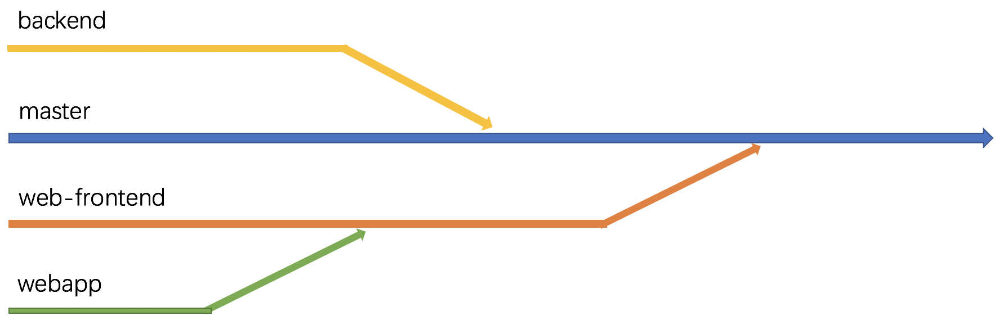
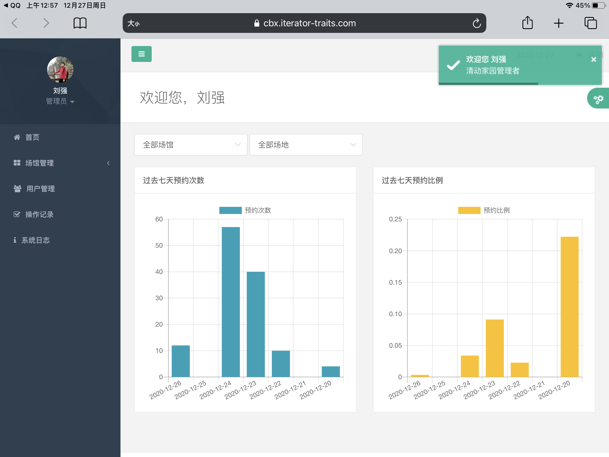

# 清动家园交付文档

*清华大学软件学院软件工程 2020年秋 C03 组*

## 交付产品

**服务器域名：**https://cbx.iterator-traits.com/

**小程序码：**

**管理员账号：**2020010001

**密码：**12345678

## 产品目标

### 📌 功能要求

#### 普通用户

通过登录清动家园小程序端，普通用户能够方便快捷地进行场馆预订，具体的操作流程如下图所示。

#### 管理员

### 📈 性能要求

## 开发组织管理

### 👣 过程管理

#### 每周会议

团队定于每周二晚9:00于南区十号楼地下讨论区举行每周会议，要求全体成员必须参加。部分成员临时有事可提前说明并重新确定当周会议日期，每次会议持续约两个小时，主要用于总结上周进展及布置下周任务，团队成员集体讨论相关问题的解决方案并尽可能地达成一致意见。

#### 集中开发

团队定于每周四下午或晚上于清华学堂地下研讨间进行集中开发，集中开发时间固定为4个小时。集中开发期间，主要解决上次会议后在实现过程中发现问题需要更改相关标准的模块。

### 👬 人员分工
**胡浩宇**

- 小程序端界面开发

- 小程序端部署

**陈柏旭**

- 数据库表与后端接口设计
- 后端用户相关接口及管理员相关部分接口
- 测试相关

**杨宇泓**

- Web前端界面开发
- Web端部署

**徐鑫浩**

- 数据库表与后端接口设计
- 后端管理员相关部分接口
- Web前端部分界面的调整与接口的对接

### 🔨 开发环境

| 类别       | 集成开发环境       | 框架          |
| ---------- | ------------------ | ------------- |
| 小程序前端 | 微信开发者工具     | VantUI + WeUI |
| Web前端    | Visual Studio Code | Vue + jQuery  |
| 后端       | Pycharm            | Django        |

### 🔑 配置管理

项目大体上沿以下4个分支进行开发。

- **master**分支存储经完备测试后的代码。
- **web-frontend**分支用于编写Web前端静态界面。
- **webapp**分支用于编写Web前端与后端的交互代码，并定期将测试后的代码merge到**web-frontend**上。
- **backend**分支主要用于后端开发。

由于小程序端开发相对独立，且小程序端开发人员所做工作与其他成员的工作耦合程度很低，故小程序前端只需定期将所做工作push到**master**分支即可。

## 系统设计

### 前端交互 - 用户系统（小程序端）

### 前端交互 - 管理系统（Web应用端）

#### 架构选择

考虑到管理员工作的主要需求在于能浏览不同类型的数据，在此之上对场馆、用户等数据记录进行管理，我们认为管理系统的交互重点与用户系统的**简单易用**不同，更应该偏向于**功能化**，同时应该合并对同样资源的重复处理。因此我们选择使用Web端进行管理系统的架构。

同时，为了适配可能出现的特别需求，我们采用了基于Bootstrap实现的响应式前端框架，在平板电脑（以iPad为例），甚至屏幕更小的手机上，我们的管理系统也有接近完整的使用体验，而不会出现样式大规模丢失或是操作流程错误的现象。

      

#### 业务实现

作为运动场馆预约系统的管理员，首要的业务需求应该在于对**场馆**、**用户**以及**预订记录**的管理。我们根据页面的结构，对上述业务实现进行介绍。

- 首页：提供过去七天内各场馆、各类运动场预定情况的数据统计结果。

  

- 场馆管理
  - 场馆列表
    - 添加新场馆：创建一个可供预约的新场馆。
    - 编辑场馆信息：对场馆基本信息（场馆说明、联系方式、场馆图片等）的修改。
    - 修改预定时间段：对场馆可预订时间、可预订场地的修改。
    - 场地预留：管理员可以根据活动举办/场地维护/课程占用等需要，对指定场地进行预留；也可以用于对工会体委上报的预订需求进行批量预订。
    - 查看预约：查看当前场馆已有的预约。

  - 用户反馈：用于查看用户的评论、评分。
  
- 用户管理：管理员在此查看用户信息，进行用户信息的批量导出，或对用户的预订记录、信用和黑名单状况进行查看和管理。

- 操作记录：管理员在此查看自己以及其他管理员的操作记录，并可以对部分误操作进行撤销。

- 系统日志：用于存放系统的发布和更新日志。

### 后端模块

### 接口规范

### 数据库设计

## 重难点问题及其解决方法

## 测试总结

### 功能测试方法

### 缺陷汇总

### 性能测试方法

### 性能测试结果

## 系统部署

### 部署环境

Ubuntu Server 20.04 LTS 64位 服务器

### 容器部署

项目使用基于 Docker (version 19.03.13) 的容器部署方式。使用到的镜像为：

- python: 3.7 - 用于部署后端应用，容器暴露 8000 端口。
- mysql: 5.7 - 用于部署数据库，容器暴露 3306 端口，与后端共享一个网络，仅供后端访问。
- nginx: latest - 用于部署代理，映射主机的 80 和 443 端口，与后端共享一个网络。

为了信息安全，数据库的隐私设置使用``.env``文件进行配置。

### NGINX反向代理部署

#### 多进程和并发链接设置

项目的 nginx 代理配置了 2 个工作进程数（worker_processes），每个进程使用 **epoll** 进行性能优化，支持的最大并发链接数为1024/进程。

#### http/https 协议设置

代理限制了请求的Header大小不超过2k（否则会返回494错误）。

请求的主体部分（body）不得超过20M。

代理开放了用于http服务的80端口，以及用于https服务的443端口。http请求将会被重定向到https的端口，同时返回**http301**。单个https的会话过期时间为一天。https使用ssl协议进行加密。

#### 代理路径设置

代理对四种路径进行分发：

- ``/`` ：非以下类型的路径将被分发到前端Vue处，作为前端网站访问。
- ``/api`` ：后端接口使用的路径，转发到后端处理。
- ``/media`` ：图片、视频等文件的访问接口。
- ``/static`` ：静态文件服务。

