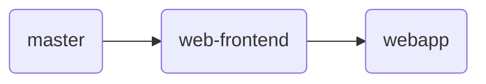

## 项目进展报告

### 项目开发进展

#### 本轮迭代计划

基于第 1 次迭代的已有工作，设计本轮迭代计划如下：

将现有后端接口与前端静态界面对接，网页版前端至少增加用户管理、场馆预留静态界面，小程序前端添加场馆预订静态界面，根据实际需求调整后端接口并进行后端代码的第 1 次重构。

#### 任务分⼯

**胡浩宇**: 小程序静态界⾯设计，小程序前端与后端接口对接，后端代码在服务器上的持续部署

**杨宇泓**: 网⻚端静态界面设计，包括用户管理、场馆预留等界面，用户管理界面与后端接口的对接

**陈柏旭**: 根据需求及时修改、添加后端接口，后端代码的第1次重构，bug修复及数据库表维护

**徐鑫浩**: 网页版前端场馆基本信息，预订信息界面与后端接口对接，bug修复及数据库表维护

#### 过程管理

⼩组会议：每周二晚进⾏⼩组会议，会议地点定在清华⼤学南区10号楼新雅书院研讨区，⼩组会议时间约为70分钟左右。

微信交流：团队成员及时在微信群中就有关问题进行交流，组长定期检查进度并与特定分工对象进行交流以保证项目的顺利进行。

集中开发：每周四下午进行集中开发，集中开发时间为 4 个小时，集中开发地点定在清华学堂地下研讨区。

#### 进度完成情况及效果展示

小程序端方面，在第 1 次迭代实现的静态页面的基础之上，完成了用户登录、用户信息修改、查看场馆，收藏场馆以及添加评论等功能。其中，查看场馆包括查看场馆的图片信息，添加评论支持附加图片，下同。

网页端方面，支持管理员查看并修改场馆基本信息，包括评价与得分等；根据不同类型的场馆修改预约时间段等用户预约相关信息，并设定修改生效时间；支持管理员查看用户并导出不同文件格式的（.txt .csv .xml等）用户信息，根据不同的关键字查找用户，设置不同的排列顺序显示用户信息；完成进入用户信息详情界面等。

此外，完成了后端在服务器上的部署及域名配置，即完成了除网页端界面以外的全部部署工作。

最后，本次迭代对后端代码进行了重构，采用django框架自带的序列化工具，极大地增强了代码美观度与可读性。

本次迭代的效果展示如下。

小程序端界面设计：

         

           

网页端界面设计：

后端代码重构：

             

此外，有关前后端具体代码的实现可在**Github**上查看，在此不再赘述。

### 配置管理

#### 项目分支管理

考虑到不同成员工作方式及工作任务的不同，汲取第 1 次迭代项目分支管理的经验教训。本次迭代共设置 3 个分支，关系图如下所示：

其中，master为主分支，web-frontend为基于master创建的分支，webapp为基于web-frontend创建的分支。由于小程序前端的开发相对独立，其相关工作主要在master上进行；后端代码经修改后将及时更新到master分支上；web-frontend主要用于前端静态界面设计，成员需及时将master分支合并到web-frontend，以使用更新后的后端代码在网页端添加新的功能；webapp为为实现前端静态界面与后端接口相连创建的分支，同样地，需要该分支成员及时将web-frontend分支合并到webapp以完善网页版前端功能。

在第2次迭代的开始阶段，**胡浩宇**及**陈柏旭**的主要工作分支为master，**杨宇泓**的主要工作分支为web-frontend，**徐鑫浩**的主要工作分支为webapp；迭代后期，由于工作需要，**陈柏旭**和**徐鑫浩**多次进行跨分支工作。

#### issue的使用

同第 1 次迭代相似，issue主要用于组长分配任务与团队成员报告问题两个方面。在本次迭代中，团队成员注意将每次提交对应到相应的issue中，相比第 1 次迭代更大地发挥了利用issue管理项目的优势。

#### 项目看板使用

同第 1 次迭代相似，项⽬目看板⽤于成员间互相监督任务的完成情况。相比于第 1 次迭代的相互监督功能，在第 2 次迭代中团队成员更加主动地将相应任务添加至项目看板中，将其用作个人工作的**To Do List**使用。

### 总结展望

#### 本轮迭代中存在问题

本轮迭代完成的工作具备一定的难度与工作量，团队成员为此付出了巨大努力。本次迭代的问题在于任务的设置没有严格基于需求的优先级，虽然完成了许多具有较大工作量的任务，但仍存在需求优先级更高的任务没有完成，这一问题希望在下一次迭代中得到改进。此外，组内成员对于接口设计的讨论交流仍不够深入，使得迭代过程中接口频繁更改，为开发工作加大了一定的任务量，希望能够在之后的小组会议中能够对相关问题进行更加深入的探讨。

#### 下一轮迭代计划

截至第13周周末，完成小程序端及网页端全部基本功能，至少包括用户小程序端场馆预订（二维码付款）、取消预订与网页端添加场地占用事件，用户预约信用管理等核心功能。在时间允许的前提条件下，设计测试用例并进行大规模测试。