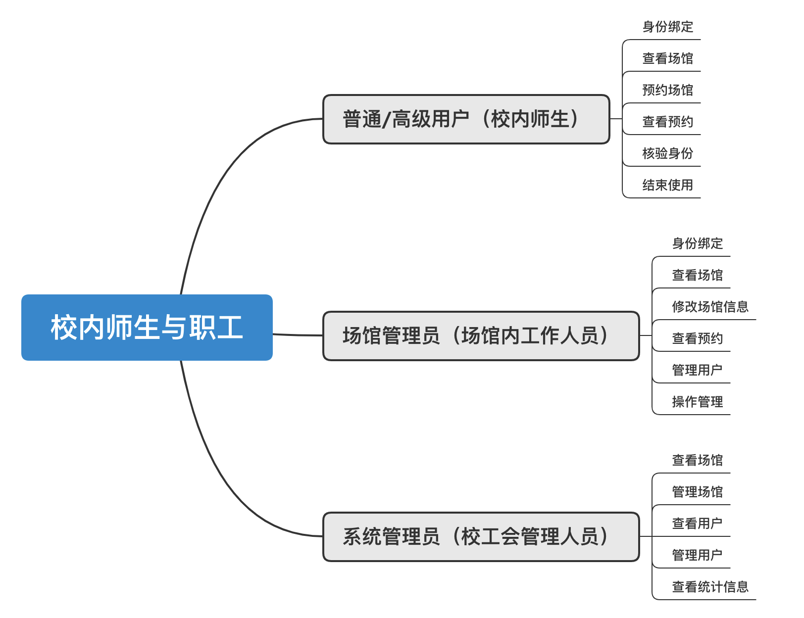
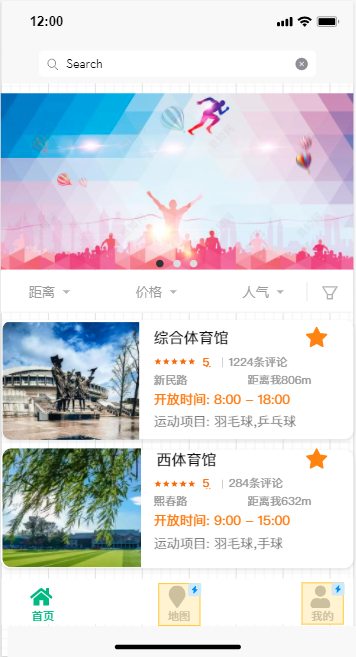
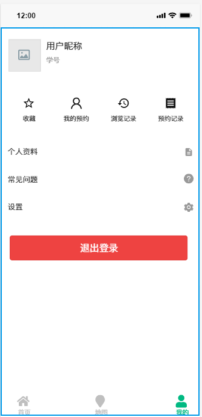
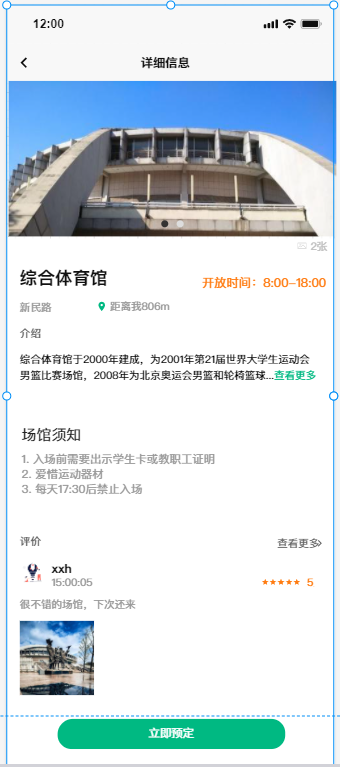
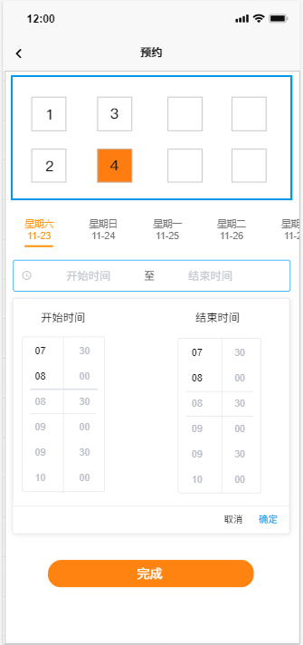

# 需求规格说明文档

项目名：清动家园

版    本：1.0

编    订：陈柏旭 杨宇泓 胡浩宇 徐鑫浩

日    期：2020-10-27

# 1. 引言

## 1.1 编写目的

本文档的目的是详细地介绍清动家园所包含的需求，以便客户能够确认产品的确切需求以及开发人员能够根据需求设计编码，以下叙述将结合文字描述，流程图，界面原型以及类图等来描述运动场馆预订系统的功能，性能，用户界面，运行环境，外部接口以及针对用户操作给出的各种响应。本文档的预期读者有客户（包括在校学生、教师、运动场馆管理员及工会系统管理员），项目经理，开发人员以及跟该项目相关的其他竞争人员和无关人员。

## 1.2 背景

本文档介绍的产品是清动家园，该软件面向所有清华校内学生及教职工，为运动场馆预订提供了用户友好的交互平台。该软件借鉴参考了北京大学智能场馆系统及清华大学研读间/研讨间预约系统，由清华大学软件学院软件工程课程C03小组开发。本产品希望能够为学生及教师提供方便快捷的场馆预约平台，方便场馆内工作人员的日常管理，并能够为校内高级管理者提供较高层次的系统管理服务。

## 1.3 定义

1) 用户访谈：事先对客户进行访谈，见面分析产品需求的过程称用户访谈。

2) 开发人员：开发本文档所介绍的产品的程序员。

3) 总期望值：全校师生广泛使用。

## 1.4 参考资料

计算机软件需求规格说明书（GB/T 9385-2008）

https://www.cnblogs.com/liquan/p/6071804.html

## 1.5 内容组织

待定

# 2. 任务概述

## 2.1 目标

清动家园是一款应清华校内师生的需求而生的运动场馆预订管理系统，与校内现有的info场馆预约系统相比，本产品旨在优化用户体验、完善进阶功能以及提供更为美观的产品界面，并解决现有的info中的场馆预订系统中存在的不支持批量预约、用户无法通过该系统找到场馆所在位置**、**预约时用户无法得知预约场地在场馆内的具体位置**、**网页端操作在众多应用场景下不够便捷以及界面设计不够美观等问题，应校内广大师生的需求，本产品将提供便捷的二维码付款服务。此外，为适应不同的需求场景，本产品将实现移动端和网页端的同时兼容。

如图所示是用户主要功能用例图。

## 2.2 用户特点

| 用户                                          | 描述                                                         |
| --------------------------------------------- | ------------------------------------------------------------ |
| 
**普通用户**
   | 对应校内学生，场馆预约系统的主要使用者。                     |
| 
**高级用户**
   | 对应校内体育教师，与普通用户相比，高级用户拥有成批次地进行场馆预约等高级权限。 |
| 
**场馆管理员**
 | 对应场馆内工作人员，能够修改场馆相关信息、设定场馆可预约状态并执行对现有预约的相关处理等操作，具有一定的管理权限。 |
| 
**系统管理员**
 | 对应校内高级管理员，具有本产品的最高管理权限，可以管理系统中的其他用户。 |

## 2.3 假定和约束

| 约束       | 描述                                                         |
| ---------- | ------------------------------------------------------------ |
| 高级语言   | 该软件客户端将采用微信小程序及网页端、采用Python结合Javascript语言编程 |
| 可靠性需求 | 由于浏览器版本不同，可能会导致网页端显示效果不同             |

# 3.需求规定

## 3.1 对功能的规定

### 3.1.1 主要功能

| 功能         | 概述                             | 用户       |
| ------------ | -------------------------------- | ---------- |
| 预定场地     | 预定某场馆，并进行线上缴费等操作 | 普通用户   |
| 批量预定     | 成批地，相对高优先级地预定场地   | 场馆管理员 |
| 维护场馆信息 | 修改场馆信息、修改预约状态       | 场馆管理员 |
| 维护人员信息 | 管理系统中的其他用户             | 系统管理员 |

### 3.1.2 业务流程（概要）

系统中的用户按照用户组进行划分，某个用户可以同时属于多个用户组，比如某个用户可能同时属于普通用户和场馆管理员，其对应的是管理人员。或者某个用户可能同时属于场馆管理员和系统管理员，对应系统的维护人员。

#### 3.1.2.1 普通用户

1）验证身份

　　用户可以通过绑定清华邮箱或者输入学生卡号的方式绑定身份（用手机号）并登录，每个邮箱&账号只能绑定一个手机号。

2）查看场馆信息

　　登录成功后，用户可以看到所有可以预定的场馆信息，如可预约时段、场馆位置、预定价格、联系方式等信息。 

3）预订场馆

　　用户可以对某一个场馆提交预定申请，在第一阶段(填报志愿阶段)用户需要等待抽签结果，并在收到预订成功后缴费，在任选阶段用户可以即时预定成功。

4）使用场馆

　　在到达场馆时可以核定身份，如通过微信扫描二维码、刷校园卡等方式。

5）评价使用

​		可以查看用户的预定记录，对场馆情况进行评价，提出建议等。

#### 3.1.2.2 场馆管理员

场馆管理员**覆盖**了普通用户的所有功能，这些功能在此略去。

1）验证身份

​		在成为普通用户的基础上提交相关信息、如来自校团委的认证验证成为高级用户。

2）查看场馆信息

​		在获取场馆信息的基础上，可以额外获取到来自用户的评价。

3)   场馆管理

​		可以修改场馆信息，包括场馆介绍，开放时间，预约时间段。

4)   预约管理

​		可以批量的预约场地，同时拥有更高的权限，可以临时修改某些用户的预约结果。

5)   用户管理

​		可以查看用户信息，拉黑用户等。

#### 3.1.2.3 系统管理员

与场馆管理员不同，系统管理员主要是管理系统中的数据信息，在数据层次进行操作。

1）查看统计信息

​		可以查看一段时间内的预定情况，场地使用情况，用户评价等等。

2)   场馆&用户管理

​		可以查看系统中每个元素的信息。额外拥有删除场馆，删除用户的权限。

### 3.1.3 用户界面

以下分别展示主页面、用户个人界面、场馆详细信息、预约界面，对于高级用户的相应界面类似，只是增加了一些工具栏。

​										

### 3.1.4 用户场景

#### 3.1.4.1 典型用户

热爱体育运动的清华大学学生

| 姓名       | 陈柏旭                                   |
| ---------- | ---------------------------------------- |
| 性别、年龄 | 男、20岁                                 |
| 职业       | 软件学院本科生                           |
| 兴趣爱好   | 羽毛球                                   |
| 动机、目的 | 锻炼身体，并且有每学期的体育运动时长需求 |
| 典型场景   | 约几名同学一起定场打球                   |
| 操作端     | 微信小程序                               |

校团委负责老师

| 姓名   | 优秀老师     |
| ------ | ------------ |
| 需求   | 管理系统信息 |
| 操作端 | web          |

# 4.运行环境规定

## 4.1 设备

操作系统为 Windows7的 pc

装有 android5.0.2的手机

## 4.2 开发环境

Windows7 操作系统

android studio 2.0

java jdk

mysql

## 4．3 接口

数据通信协议：TCP/IP 协议

## 4.4 控制

待定

# 5.验收标准

| 测试功能             | 输入/操作                                   | 检验点                               | 预期结果               | 验收 |
| --------------------  | ------------------------------------------- | ------------------------------------ | -------------------------- | ---- |
| 登录功能                        | 在用户名处输入学号/工号，在密码栏输入用密码 | 用户名和密码检查，密码保护           | 通过验证系统进行身份验证，当用户名密码与数据库中的内容一致时，登录成功，否则失败且显示提示信息。密码应当被隐藏。 |      |
| 主页面显示 | 登陆后可见 | 显示各个运动场馆的简略信息 | 每个场馆的图片与简略信息能够正确显示，未能成功加载的图片会被一个默认图片替代。整个界面布局与字体大小正常。 |      |
| 主页面搜索 | 在搜索框输入场馆的名称或名称的一部分 | 搜索框显示，搜索结果显示 | 搜索框应当显示在正确的位置，点击搜索框后能够正常地跳出输入法面板。输入信息后应当正确显示搜索到的场馆。 |      |
| 主页面排序       | 点击排序按钮                                   | 显示排序结果，正确排序         | 在点击排序按钮后，场馆信息会根据排序的键值按顺序排列，并正确地显示在屏幕上 |      |
| 场馆详细信息显示     | 点击某个场馆的名字                 | 显示详细信息             | 成功显示场馆详细信息，场馆的图片能够正常滚动播放，如果加载失败会显示默认图片。场馆的介绍，须知能够通过下拉菜单打开和收起。 |      |
| 场馆位置显示 | 在场馆详细信息界面中点击位置按钮                  | 地图加载，位置显示 | 正确显示地图以及场馆位置，场馆位置通过醒目的记号标注。地图可以放大缩小和旋转。 |      |
| 场馆预定信息 | 在场馆详细信息下方点击预定按钮 | 场馆内场地信息，已预约时间段，可预约时间段 | 在场馆预约界面能够看到场馆内的场地布局，在点击某个场地后能显示该场地在未来几天内的预约状况，已预约时间段和未预约时间段分别用不同的颜色标注。 | |
| 场馆预定 | 选择一个可以预定的场地和时间，然后点击预定按钮 | 场地是否可预约检测，预约时间检测，价格计算 | 选择的预约时间应当是可预约时间段，时间段可以单选或多选，但总时长不得超过上限。价格应当根据市场进行计算并显示在界面上。 | |
| 预定付费 | 在选择好预约时间后，点击付费。 | 付费时间限制，界面跳转 | 确认预约后应当在限定时间内完成付费，可以选择多种在线付费方式并正确跳转到对应的页面。 | |
| 用户信息 | 在页面下方点击用户按钮 | 显示用户菜单 | 能正确显示用户菜单中的各个选项 | |
| 预约记录 | 在用户菜单中点击我的预约 | 显示用户预约记录 | 按照时间倒序显示用户的预约记录，尚未开始的，正在进行的和过去的预约应当加以区分。尚未开始的预约应存在取消按钮，过去的预约应存在删除按钮。 | |
| 预约提醒 | 自动 | 提醒时间，提醒内容 | 在用户的预约的时间即将开始时或者即将结束时，软件应当发送提醒 | |

 